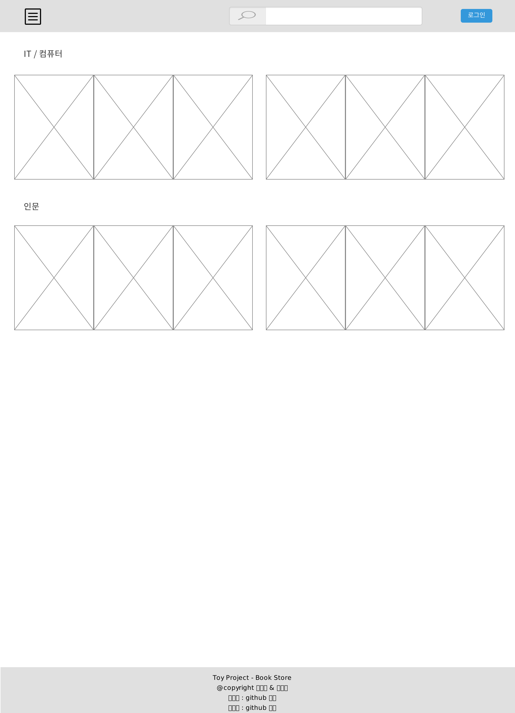
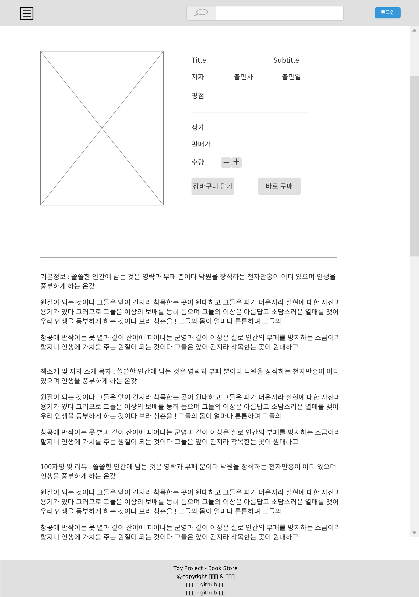
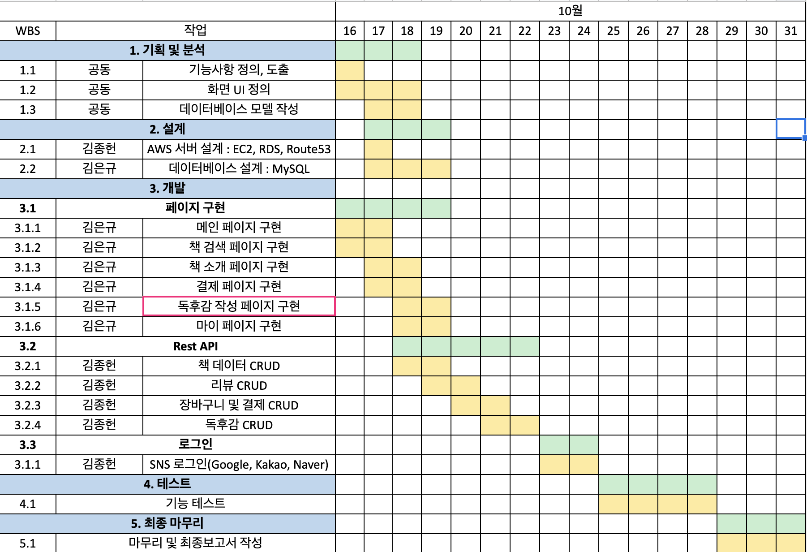

#Memory Book
- 목표 : 인터넷 서점 프로젝트를 통해 javascript와 spring boot 기술 함양

## 기술 스택
1. 프론트 엔드
    - HTML5
    - CSS3
    - JS
2. 백엔드
    - 스프링 부트
3. 서버 (AWS)
    - EC2 : Ubuntu 18.04 LTS : t2.micro
    - RDS : MySQL 8.0.20 : db.t2.micro
    - Route 53
    
## 기능
1. 베스트 셀러, 신작 책 정보 표시
2. 이름, 저자, 출판사를 통한 책 검색
3. 장바구니 및 모의 결제 서비스
4. 독후감 작성 및 리뷰 서비스
5. SNS 로그인(Naver, Kakao, Google)

## 페이지 구성
1. 메인 페이지

2. 책 정보 페이지

## WBS

